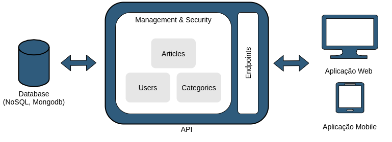

[//]: # (Título e Descrição)
<h1 align="center"> General API for Blog Applications </h1>

[//]: # (Nome do Projeto)
<p align="center"> Created to manage blogs in general, the idea originated from the development of my blog "Espaço de conhecimento em IoT"</p>

[//]: # (Badges)
<p align="center">

  

  <a href="http://standardjs.com">
    
  </a>

  <a href="https://github.com/tgmarinho/nlw1/commits/master">
    
  </a>

  <a href="https://badges.frapsoft.com/os/v1/open-source.svg?v=103">
    
  </a>

  <a href="https://github.com/lukemorales/rocketshoes-react-native/issues">
    
  </a>

   <a href="https://github.com/tgmarinho/nlw1/stargazers">
    
  </a>
</p>

[//]: # (Tabela de Conteúdos)
<p align="center">
 <a href="#overview">Overview</a> •
 <a href="#demo">Demo</a> • 
 <a href="#technologies">Technologies</a> • 
 <a href="#prerequisites">Prerequisites</a> • 
 <a href="#install">Install</a> • 
 <a href="#usage">Usage</a> • 
 <a href="#contributing">Contributing</a> • 
 <a href="#licence">Licence</a> • 
 <a href="#author">Author</a>
</p>

<h4 align="center"> 🚧  Project Status: Under construction...  🚧 </h4>

<h2 id="overview"> 💻 Overview </h2>

The API stores and makes available **articles** and **categories** of the blog, allowing the creation of **authors** and **administrators** accounts.

<h1 align="center">
    
</h1>

[//]: # (Listar as Funcionalidades da Aplicação.)
## 📑 Lista de Features

- [x] User registration
- [x] User access
- [x] Add articles
- [x] Edit article
- [x] List articles
- [x] Delete articles
- [x] Create category
- [x] Edit category
- [x] List sub-categories in tree form
- [x] List all categories
- [x] Delete category

<h2 id="demo"> 🧪 Demo </h2>

  - [**Blog Frontend hosted in Github Pages**](https://lucaslui.github.io/blog/)

  - [**Swagger of the Blog API hosted in Heroky**](https://dashboard.heroku.com/apps/espaco-de-conhecimento-backend)

<h2 id="technologies"> 🧰 Technologies </h2>

The following tools were used in the construction of the project:

- [Node.js](https://nodejs.org/en/)
- [TypeScript](https://www.typescriptlang.org/)
- [Express](https://expressjs.com/pt-br/)
- [Mongodb](https://www.mongodb.com/)
- [Swagger](https://swagger.io/)

<h2 id="prerequisites"> 🛠 Prerequisites </h2>

Before starting, you will need to have the following tools installed on your machine:

  - npm >= 5.5.0
  - node >= 12.0

<h2 id="install"> 🏗️ Install </h2>

From your command line:

```bash
# Clone this repository
$ git clone https://github.com/lucaslui/blog-backend

# Go into the repository
$ cd blog-backend

# Install dependencies
$ npm install
```

The project uses [MongoDB](https://www.mongodb.com/).

I recommend use [Docker](https://www.docker.com) to install and run the database above.

<h2 id="usage"> 🚀 Usage </h2>

From your command line:

```sh
  npm start
```

<h2 id="contributing"> 🤝 Contributing </h2>

[//]: # (Pull requests are welcome. For major changes, please open an issue first to discuss what you would like to change.)

[//]: # (Please make sure to update tests as appropriate.)

All kinds of contributions are very welcome and appreciated!

-   ⭐️ Star the project
-   🐛 Find and report issues
-   📥 Submit PRs to help solve issues or add features
-   ✋ Influence the future of API with feature requests

And make sure to read the [Contributing Guide](/CONTRIBUTION.md) before making a pull request.

<h2 id="license"> 📝 License </h2>

This project is [GPL 3.0](./license) licensed. See the [LICENSE](./license) for more information.

<h2 id="author"> 👤 Author </h2>

Created by [Lucas Lui](https://github.com/lucaslui) 👋🏽 Please feel free to contact me!

[](https://www.linkedin.com/in/lucas-lui-motta/) 
[](mailto:lucasluimotta@gmail.com)
